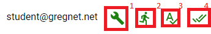

# EdHD
An application for creating and completing Hadoop MapReduce based assignemnts

## Requirements
* Google Chrome
* Postgres with password authentication
* Java JDK 8
* Hadoop 3.0.0
** Instructions for creating a single node cluster can be found [here](https://hadoop.apache.org/docs/r3.0.0/hadoop-project-dist/hadoop-common/SingleCluster.html)

### Notes on Hadoop requirements
* EdHD must be installed allongside a valid installation of Hadoop.  The Hadoop installation can be configured to point to a remote cluster, but EdHD shoudl be able to resolve all ot the nodes.  EdHD has only been tested running on the Master node.
* The Hadoop binaries must also be on the path.

## Running

1) Download or clone this repository
2) Ensure Hadoop binaries are on the path (execute `hadoop classpath`)
3) Make environment specific changes to [application.yml](./src/main/resources/application.yml)
    * You can optionally make your own application.yml external to this and use it at run time
4) Run `./gradlew clean build`.  This will create an executable `war` in build/libs
5) `cd build/libs`
6) `java -jar edhd-0.0.1-SNAPSHOT.war`
    * If using an external yml file, run `java -jar edhd-0.0.1-SNAPSHOT.war --spring.config.location=classpath:file:///path/to/your/application.yml`
7) In Chrome, navigate to localhost:8080 (or whatever port you configured the app to run on)
    
## Using EdHD

### User management
When you fist navigate to EdHD, you will see the sign in/ registration screen.

From here, you can login if you've already signed up, or you can register a as a new user.

#### Admin Privileges
When a user signs up, they do not have admin privileges.  Admin privileges are required to:
* Create/Edit/Delete assignments
* Download submissions
* Upload/delete files via the HDFS browser.

To add or remove admin privileges to or from your account:
1) Login
2) Click the user icon in the top right
3) Click User Settings

4) Toggle `Is Administrator` and enter the EdHD administrative password configured in `application.yml`
5) Click `UPDATE ADMIN SETTINGS`

### HDFS Browser
EdHD includes a built-in HDFS browser.  Once logged in, it can be accessed from the left side bar.

Explanation:
1) Displays the current location shown in the HDFS browser
2) Creates a new folder under the current location 
    * Requires admin privileges
3) Uploads a file under the current location in HDFS
    * Requires admin privileges
    * Limit of 2GB (can be changed by changing the value of `spring.http.multipart.max-file-size`)
4) Navigation helpers
    * Go up one level
    * Refresh the current view
5) HDFS File Actions
    * Recursively delete entry (Requires admin privileges)
    * Download file 
6) HDFS Navigation - click to navigate to location
    * If location is a directory, the HDFS browser will go there
    * if location is a file, a preview will be displayed in section 7
7) File preview displays the first `edhd.hadoop.hdfsFilePreview` lines of a file in HDFS

### Assignments
The assignment screen displays information about assignments registered with EdHD, allows for creating assignment submissions, and viewing submission status information.
It can be viewed by selecting `Assignments` in the side bar.  Except for due date, there are no other restrictions on submissions at this time.

#### The Assignment Card
Each assignment is represented by an assignment card with the following information:

1) Assignment name and due date
2) Assignment description
3) Submission status information
4) Hides and shows the submission configuration form
5) Submit assignment solution
6) Admin Actions (requires admin privileges)
    * Edit assignment.  This will open and load the assignment creation screen with the info for the selected assignment
    * Delete assignment.  This will delete the assignment and all submissions for it.
    * Download submissions.  This will collect and download all submissions for the assignment into a single zip archive
    
##### Configuring a submission
If the user clicks `SHOW/HIDE CONFIGURATION`, they will see the submission configuration form.  This form is how users configure their submission and has the following parts:

1) Assignment source selection
2) Standard job options
3) Custom job options

###### Assignment Source
The Assignment source must be a zip file containing all the files needed to compile the submission.
The Java source files must be in proper package directories.
For example, if a submission contains the class `org.meltzg.WordCountMapper`, the archive must have the source file in `<zip file>/org/meltzg/WordCountMapper.java`
This is necessary for submission compilation.

###### Standard Job Options
These fields represent the classes needed to run the submission.  Each MapReduce lifecycle class must be set using the fully qualified class name.
See [GenMapred](https://github.com/meltzg/GenMapred) for more information about individual fields.  Fields that are greyed out are set in the assignment definition and cannot be overridden.

###### Custom Job Options
These fields are custom configuration properties that will be accessible vie the Job's Context's Configuration.  Users can add any fields they like here.
Fields that are part of the assignment definition (shown in the table) can only be added again by the submitter if the field is marked as appendable.
If the submitter adds an existing, appendable field, their value will be appended to the value in the definition with a `|` between.

##### Submission Status Indicator

Along with the submitter's username, the status indicator shows:
1) Compilation status
2) Submission run status
3) Submission validation status
4) Submission complete status.

Any stage marked as red is a failed stage.  Each indicator can be clicked to show more information.  For example,
if compilation failed, the info dialog for that indicator would contain compiler errors.

Only admins will see the status of all submissions.  Normal users will only see the status of the validator and their own submission.

### Assignment Creation
EdHD admins can create assignments via the `Create Assignment` view in the side bar.

1) Assignment Information
    * Description supports multiple lines of text
2) Assignment/Validation configuration selector - switches the configuration form between the assignment configuration and the validator configuration
3) Assignment source selection (same restrictions as the src selector on the assignment card)
4) Standard Options
5) Custom Options
6) Actions

#### Assignment and Validation configurations
The Assignment configuration form represents the configurations for the assignment that all submissions will use.
The Validation configuration is analogous to the Submission configuration.  When the assignment is created,
EdHD runs the Validation submission and later uses its output to validate user submissions.  Values set in the Assignment configuration will
immediately be reflected in the Validation configuration and cannot be overridden.

#### Updating Assignment Definitions
As mentioned previously, assignment definitions can be updated by clicking the edit button on the assignment card.
That will bring the user to this form with the fields filled with the current values.

The `CREATE ASSIGNMENT` button will say `UPDATE ASSIGNMENT` instead.  If you change your mind, hitting the `RESET` button
will clear the form and it will then be ready for creating a new assignment.

When updating an assignment, Assignment Source sections that previously had values will display the name of the zip file used.

If you want to replace the archive, hit the `delete` icon, then select a new zip.